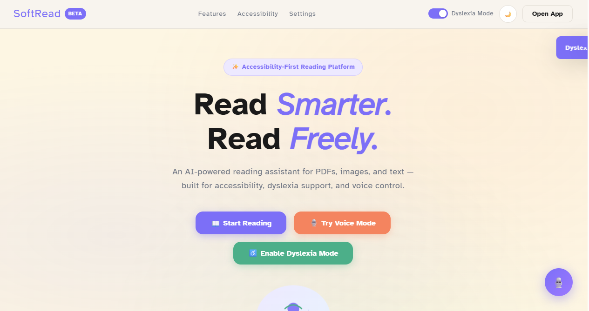
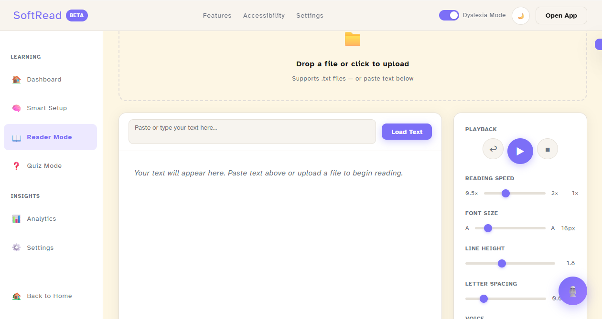
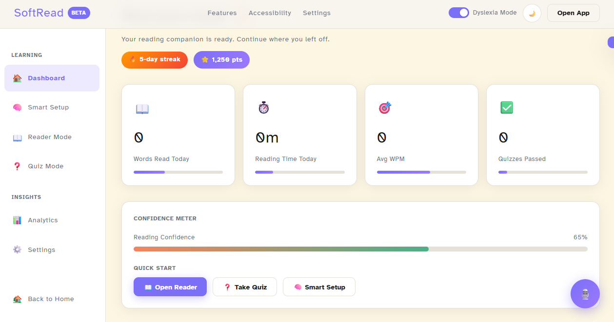
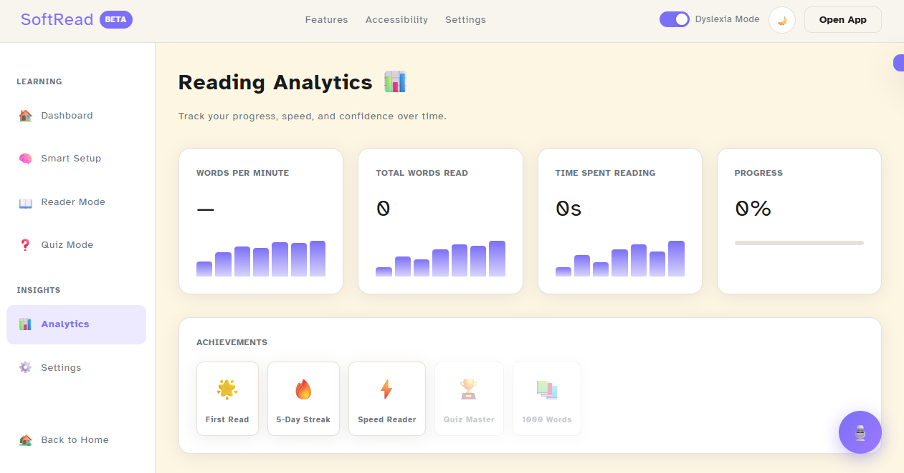
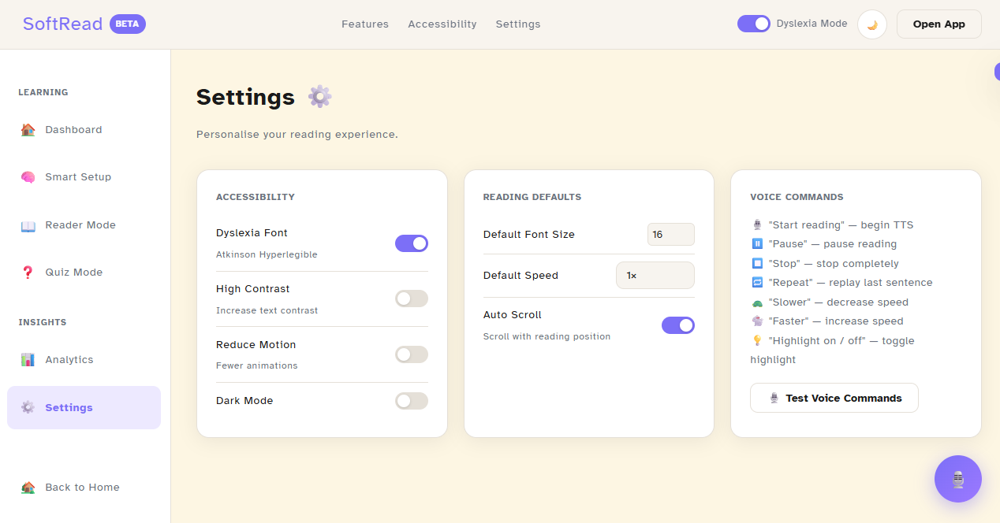

📌Live Demo: https://zainabkn7890-creator.github.io/BASELINE./

# BASELINE.
Soft Read is an AI-powered accessibility-first reading platform that turns study material into voice reading, quizzes, and adaptive learning tools.
A platform that transforms dense study material into accessible, multi-format learning for neurodiverse and underserved students.

📌 What it does
-Converts text into simpler readable formats
-Supports dyslexia-friendly reading modes
-Provides audio reading support
-Enables visual learning formats like flowcharts & summaries

📌 Status
Prototype for hackathon submission. Documentation and features will be added progressively.

## Demo Screenshots

